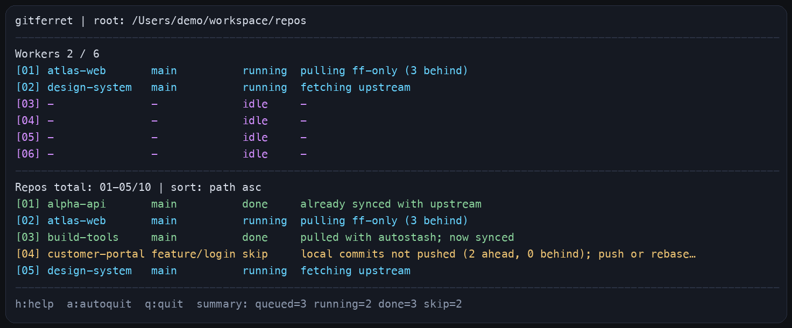

# gitferret

Recursively finds Git repositories in subfolders and pulls them in parallel, without descending into nested repos.

This is not a full sync workflow and does not push local commits.



## Usage

By default, gitferret runs with up to `MIN(cpu cores, 4)` workers in parallel.

If you want to force a different worker count, use the `-w` option.

### Run directly

```bash
python3 ./gitferret.py
```

```bash
python3 ./gitferret.py -w 10
```

### Install and use globally

#### macOS

```bash
./install.sh
cd <repo-root>
gitferret
```

#### Windows

```powershell
.\install.cmd
cd <repo-root>
gitferret
```


## When It Is Useful

- When you manage many Git repositories under one root folder and want to check or sync them in one pass
- When you work across multiple devices such as home and office machines and want to bring a local repo set back in sync quickly
- When you want to quickly find repositories that are already up to date, missing an upstream, ahead of remote, or blocked by local changes
- When you want a lightweight terminal UI for reviewing sync status across repositories without opening each one manually

## Potential Risks

- This program runs `git fetch` and `git pull --ff-only` against discovered repositories, so it updates local repository state rather than only inspecting it
- If a repository has local changes, the program may use `--autostash`, and some cases may still need manual review
- Running this across many repositories may trigger many remote requests in a short time

## Controls

- `s`: change sort mode
- `r`: reverse sort order
- `w`: toggle Workers rows
- `a`: toggle autoquit
- `h`: show help
- `q`: quit
- `Up` / `Down` or `k` / `j`: scroll the Repos list by one line
- `PageUp` / `PageDown`: scroll the Repos list by one page
- `Home` / `End` or `g` / `G`: jump to the top or bottom of the Repos list
