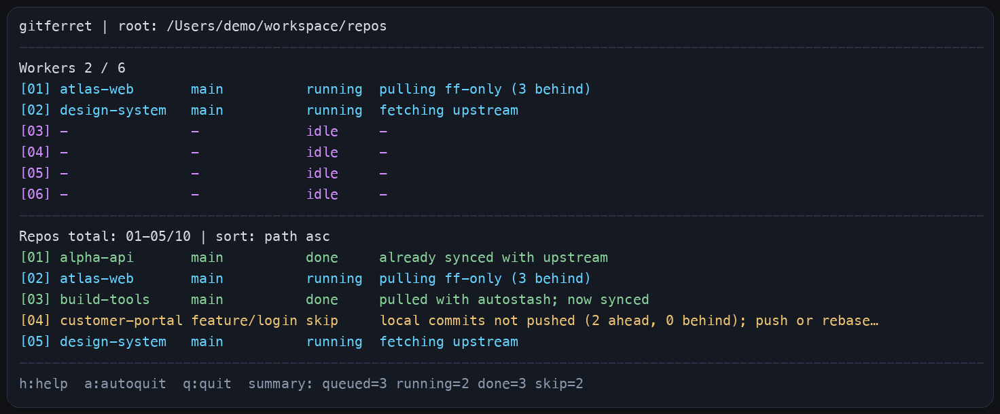

# gitferret

Recursively finds Git repositories in subfolders and pulls them in parallel, without descending into nested repos.

This is not a full sync workflow and does not push local commits.



## Installation

### macOS / Linux
```bash
./install.sh
```

### Windows
```powershell
pip install -e .
```

## Running

Run from any directory or repository root:

```bash
gitferret
# or as a Git subcommand:
git ferret
```
*(Tip: Use `git ferret -h` for help when calling via Git.)*

## Options

By default, `gitferret` runs with up to `MIN(cpu cores, 4)` workers in parallel.

- `[root]` or `--root [ROOT]`: Target folder to scan (e.g. `gitferret ../repos`, defaults to `.`)
- `-w WORKERS`: Override worker count (e.g. `gitferret -w 10`)

Settings are automatically persisted in `settings.json`:
- Windows: `%USERPROFILE%\.gitferret\settings.json`
- macOS / Linux: `~/.gitferret/settings.json`

Saved settings include sort mode, reverse sort, worker rows visibility, and autoquit.

## Controls

- `s`: cycle sort column (`NO` -> `REPO` -> `BRANCH` -> `STATE`)
- `<` / `>`: step through sort column left / right
- `r` or `Ctrl+R`: toggle sort direction (asc / desc)
- `w`: toggle worker status panel
- `a`: toggle autoquit
- `Up` / `Down` or `k` / `j`: navigate repository list
- `PageUp` / `PageDown`: scroll page up / down
- `Home` / `End` or `g` / `G`: jump to top / bottom
- `q` or `Ctrl+C`: quit
- Click any table column header to sort by that column (or reverse direction)


## When It Is Useful

- When you manage many Git repositories under one root folder and want to check or sync them in one pass
- When you work across multiple devices such as home and office machines and want to bring a local repo set back in sync quickly
- When you want to quickly find repositories that are already up to date, missing an upstream, ahead of remote, or blocked by local changes
- When you want a lightweight terminal UI for reviewing sync status across repositories without opening each one manually

## Potential Risks

- This program runs `git fetch` and `git pull --ff-only` against discovered repositories, updating local repository state
- If a repository has local changes, the program may use `--autostash`, and some cases may still need manual review
- Running this across many repositories may trigger many remote requests in a short time

## Development

For local development setup, testing, and project architecture details, see the [Developer Guide](docs/development.md).
